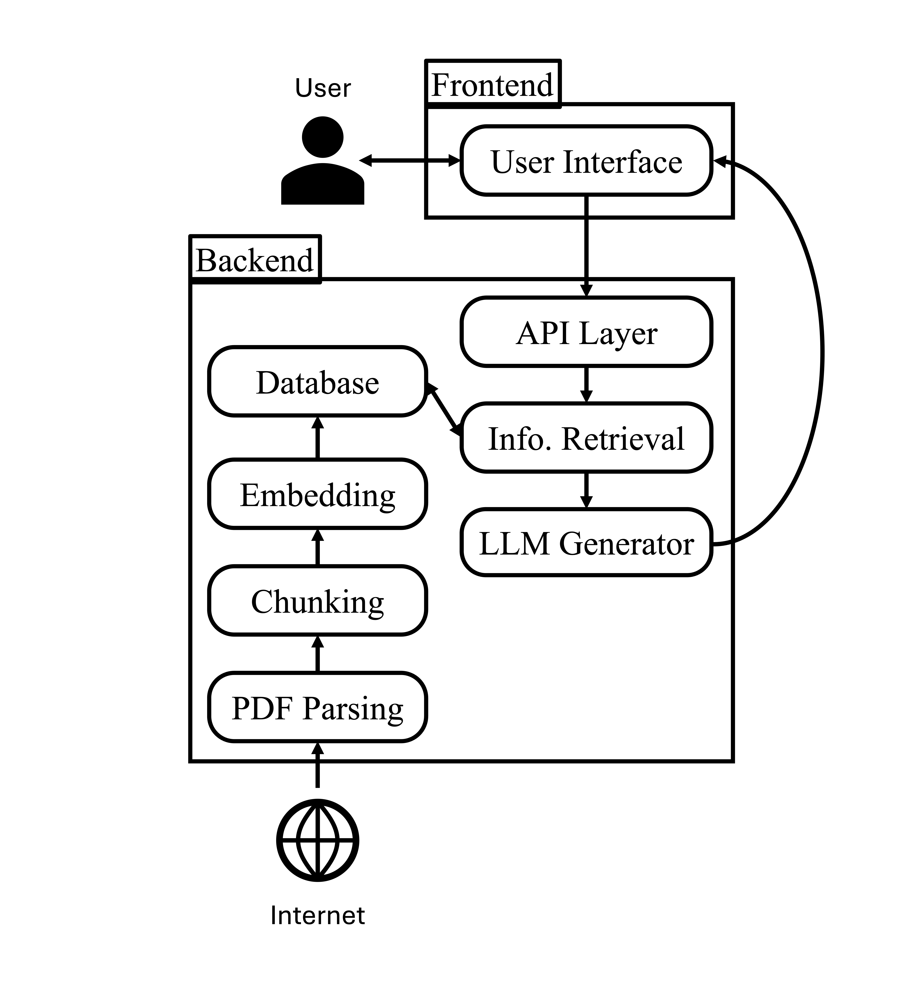

<div align="center">
	
</div>

# ESG Reporting Generator

ESG Reporting Generator is a Retrieval Augmented Generation system for producing structured ESG reports for public companies. The repository contains the full stack needed to ingest company reports, search them with hybrid retrieval, and generate standardized evaluation reports through a web interface.

## Usage

<div align="left">
	
</div>

1. Pick a company and an evaluation criterion in the frontend.
2. Press the **Evaluate** button.
3. Wait for report generation, which typically takes around 15 seconds.
4. Review the markdown report in the UI and save it as a PDF when needed.

For an example report, click here: [report.pdf](docs/report.pdf).

Supported companies in the database:

<table border="0" cellspacing="0" cellpadding="0">
	<tr>
		<td>Glencore</td>
		<td>ABB</td>
		<td>Nestlé</td>
		<td>UBS</td>
	</tr>
	<tr>
		<td>Lonza</td>
		<td>Swiss Re</td>
		<td>Swisscom</td>
		<td>Givaudan</td>
	</tr>
	<tr>
		<td>Novartis</td>
		<td>Partners Group</td>
		<td>Lindt &amp; Sprüngli</td>
		<td>Swatch</td>
	</tr>
	<tr>
		<td>Roche</td>
		<td>Logitech</td>
		<td>Richemont</td>
		<td>Zurich Insurance</td>
	</tr>
	<tr>
		<td>Geberit</td>
		<td>Holcim</td>
		<td>Sika</td>
		<td>Swiss Life</td>
	</tr>
	<tr>
		<td>On</td>
		<td>Amrize</td>
		<td></td>
		<td></td>
	</tr>
</table>

Available evaluation criteria:

<table border="0" cellspacing="0" cellpadding="0">
	<tr>
		<td>Overall ESG Assessment</td>
		<td>Environment (E) Summary</td>
	</tr>
	<tr>
		<td>Social (S) Summary</td>
		<td>Governance (G) Summary</td>
	</tr>
	<tr>
		<td>Climate Risk Management</td>
		<td>GHG Emissions &amp; Metrics</td>
	</tr>
	<tr>
		<td>Energy Transition &amp; Renewables</td>
		<td>Water &amp; Biodiversity Stewardship</td>
	</tr>
	<tr>
		<td>Supply Chain Sustainability</td>
		<td>Labor Practices &amp; Worker Rights</td>
	</tr>
	<tr>
		<td>Diversity, Equity &amp; Inclusion</td>
		<td>Data Privacy &amp; Cybersecurity</td>
	</tr>
	<tr>
		<td>Anti-Corruption &amp; Business Ethics</td>
		<td>Disclosure, Targets &amp; Reporting Quality</td>
	</tr>
</table>

## Database

The database contains reports from public companies. For this project, the corpus includes SMI companies and other reputable companies such as UBS, Roche, and Swatch. The documents cover annual reports, sustainability reports, compensation reports, and corporate governance reports from 2020 to 2025. Overall, we processed a total of 265 documents.

## Architecture

<div align="left">
	
</div>


The system is organized into two pipelines.

### Ingestion pipeline

Raw PDFs are parsed into structured fields: company, document title, year, and raw text string. The text is then split using semantic chunking, where sentence embeddings are compared and boundaries are introduced when the semantic difference becomes large enough. The resulting chunks are embedded with BAAI/bge-base-en-v1.5 and stored together with their metadata in PostgreSQL.

To seed the database, run:

```bash
python3 backend/scripts/seed_db.py
```

For proper parsing, place PDFs in `data/raw_pdfs` and name them using the following pattern:

```text
COMPANY NAME_DOCUMENT TITLE_YEAR.pdf
```

You can also use the LLM-based `renamer.py` script in `backend/scripts/` to standardize filenames before seeding.

### Generation pipeline

The frontend sends the selected company and evaluation criterion to the FastAPI backend. Based on the criterion, the backend selects a predefined query and sends it to retrieval. Retrieval uses both BM25 and vector search, then fuses the rankings with a linear combination and applies a reranker (`ms-marco-MiniLM-L-12-v2`). Querying is filtered by company so the system only returns chunks related to the selected organization. The top-k retrieved chunks, with a default of 10, are passed into a prompt that instructs the LLM generator to produce a standardized report. The generator uses Qwen 2.5-1.5B on GPU/CUDA when available, with CPU as a slower fallback. The final report is returned in markdown format to the frontend via the API response.

## Quick Start

### Prerequisites

- Python
- virtualenv
- PostgreSQL with the `pgvector` extension
- Optional GPU for faster embeddings and LLM generation

### Clone and environment

```bash
git clone https://github.com/lazi-nhr/esg-reporting-rag-system
cd /path/to/esg-reporting-rag-system
cp .env.example .env
```

Edit the copied `.env` as described in the **Configuration** section below.

### Install

```bash
cd backend
pip install -r requirements.txt
```

### Full stack run

```bash
cd /path/to/esg-reporting-rag-system
python setup.py
```

This checks the database, loads sample data, warms up the model, and starts both servers. To stop everything and clean logs/data, run:

```bash
python cleanup.py
```

### Backend only

```bash
cd backend
python main.py
```

Or use the helper scripts:

```bash
python start_backend.py
python stop_backend.py
```

### Frontend only

```bash
cd frontend
python start_frontend.py
python stop_frontend.py
```

### Open the frontend

Open the VS Code Server URL for port 3000 in your browser:

1. Open the **Ports** tab in the bottom panel.
2. Find port `3000`.
3. Click the forwarded address link.

### Logs

```bash
tail -f /tmp/backend.log
tail -f /tmp/frontend.log
```


### 5. View GPU usage (cuda only)

```bash
watch -n 1 nvidia-smi
```

## Configuration

The main configuration lives in [backend/app/core/config.py](backend/app/core/config.py). Important environment variables include `BACKEND_PORT`, `HF_API_KEY`, `DB_*`, `EMBEDDING_MODEL`, `MIN_CHUNK_TOKENS`, `MAX_CHUNK_TOKENS`, and `BACKEND_STARTUP_TIMEOUT`.

## Deployment and Hardware Considerations

This project was deployed on Nuvolos using three isolated pods on a private subnet: a web frontend pod, a FastAPI backend pod, and a PostgreSQL pod. The frontend reverse-proxies API requests to the backend because the backend and database hostnames are only reachable on the internal Nuvolos network.

The system performs best on GPU, especially for embeddings and LLM generation. CPU execution is possible, but report generation is slower.

## Network Layout on Nuvolos

Nuvolos runs applications as pods inside Kubernetes. The frontend pod serves the UI and reverse-proxies requests to the backend pod, while the backend pod talks to PostgreSQL on the internal subnet. External browsers can reach the app only through the Nuvolos reverse proxy, which is why the frontend sits between the browser and the backend.

## APIs and Endpoints

| Method | Path | Description |
|---|---|---|
| POST | `/evaluate` | Evaluate a company and an evaluation criterion |
| GET | `/companies` | Get the list of distinct companies available in the database |
| GET | `/criteria` | Get the list of available criteria defined in [backend/app/core/config.py](backend/app/core/config.py) |

## Evaluation Criteria

Evaluation criteria are defined as a list in [backend/app/core/config.py](backend/app/core/config.py). Each criterion entry contains:

- `id`: stable identifier used by the frontend and backend
- `name`: human-readable label shown in the UI
- `description`: short explanation of the criterion
- `category`: broad group such as environment, social, or governance
- `question`: the prompt sent to the generator
- `context_instructions`: extra guidance for report generation
- `output_format`: expected report shape
- `required_fields`: fields that should be covered in the answer
- `retrieval_bias`: keywords used to bias retrieval toward relevant chunks

To add a new criterion, append a new dictionary to `EVALUATION_CRITERIA`. To remove one, delete its dictionary from the list. Keep the `id` stable if the frontend or existing reports depend on it.

## Chunking

Semantic chunking splits text by comparing sentence embeddings. Each sentence is embedded, neighboring sentences are compared, and a chunk boundary is created when the semantic difference becomes large enough. This helps preserve meaning better than fixed-size splitting for long ESG reports.

## Further Work

- Add more reports and expand the database
- Add additional refining filters such as year filtering
- Add chat functionality to the UI
- Add plotting capabilities to the reports
- Add a company comparison feature

## Contributors

- Dan Friedman - Backend Engineer
- Peng Liu - RAG Engineer
- Liun Grichting - Frontend Engineer
- Lazaro Hofmann - System Architect